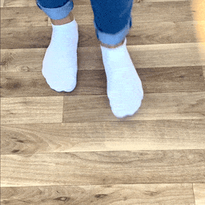

<!--
This README describes the package. If you publish this package to pub.dev,
this README's contents appear on the landing page for your package.

For information about how to write a good package README, see the guide for
[writing package pages](https://dart.dev/guides/libraries/writing-package-pages).

For general information about developing packages, see the Dart guide for
[creating packages](https://dart.dev/guides/libraries/create-library-packages)
and the Flutter guide for
[developing packages and plugins](https://flutter.dev/developing-packages).
-->

# DeepAR Shoe Try-On Flutter Plugin

The official DeepAR plugin for integrating AR Shoe Try-On with Flutter.



## Getting Started

In the `pubspec.yaml` of your flutter project, add the following dependency:

```yaml
dependencies:
  ...
  deepar_shoe_try_on_flutter: ^1.0.1-beta
```

Import it:

```dart
import 'package:deepar_shoe_try_on_flutter/deepar_shoe_try_on_flutter.dart';
```

Add [camera permissions](https://pub.dev/packages/permission_handler#setup) to your iOS and/or Android app.

## Usage

Add `DeepARShoeTryOnPreview` widget to your app.

```dart
@override
Widget build(BuildContext context) {
  return Scaffold(
    appBar: AppBar(title: const Text('Flutter Simple Example')),
    body: DeepARShoeTryOnPreview(link: Uri.parse("https://demo.deepar.ai/flutter/shoe/nike-airforce1.deepar")),
  );
}
```

### Android Platform Views

This plugin uses
[Platform Views](https://flutter.dev/docs/development/platform-integration/platform-views).

You should however make sure to set the correct `minSdkVersion` in `android/app/build.gradle` if it was previously lower than 19:

```groovy
android {
    defaultConfig {
        minSdkVersion 19
    }
}
```

